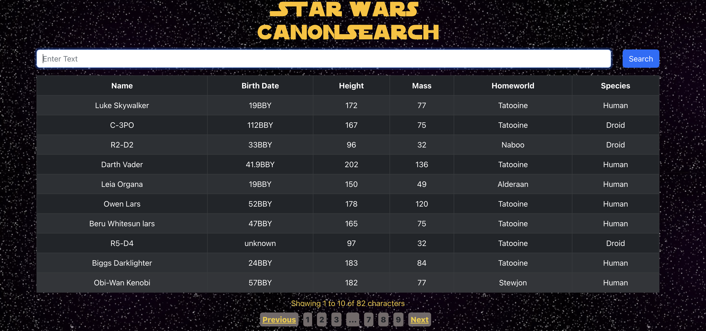

# Star Wars API App

 

Basic data app using React, Axios, Bootstrap, and Node 

 

Try it [here]()

## Summary 

This was the first app that I've built using Axios and APIs in general. I learned how to set up async/await commands with promise requests and built a deeper understanding of how data is requested from an API, how it's retrieved, and how it's handled for the user experience. It was awesome to build logic for these requests and populate a table with the retrieved information. This was very challenging and very rewarding and I look forward to continously building these types of applications!

## Author

- Gary Hughes Jr - _Full-Stack Developer_ - [Website](https://garyleehughesjr.com/) | [LinkedIn](https://www.linkedin.com/in/gary-hughes-jr-64925b229/)